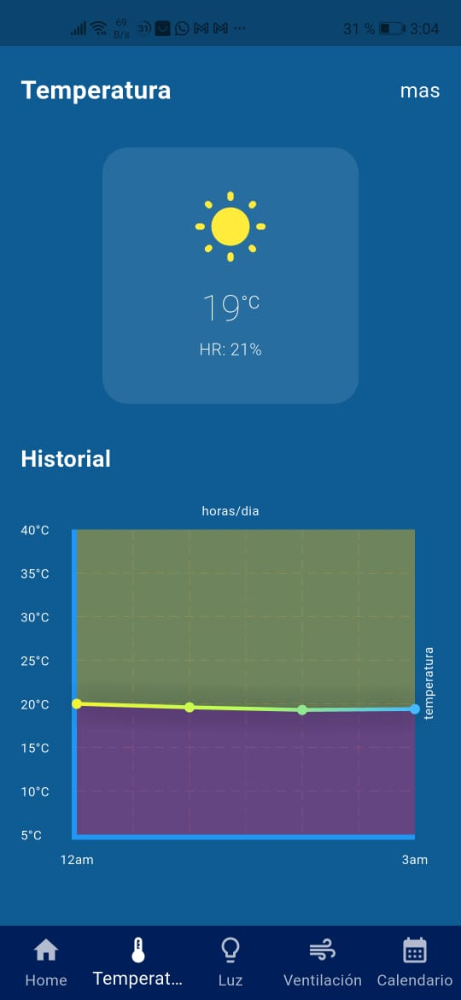

# PetSafe - Sistema de Monitoreo y Control IoT para Mascotas

## Objetivo General
Desarrollar una aplicación móvil multiplataforma con **Flutter** que permita monitorear y controlar en tiempo real el entorno de mascotas mediante dispositivos IoT y servicios de cloud computing, para garantizar su seguridad, comodidad y bienestar en ausencia de sus dueños.

---

## Requisitos Cumplidos
a) La implementación del aplicativo está completamente funcional.  
b) El código está disponible en GitHub.  
c) La documentación sobre la funcionalidad y arquitectura está en este README.  
d) Incluye la documentación necesaria para ejecutar el aplicativo (usuario y contraseña).  
e) El instalador APK se encuentra en el repositorio.  

---

## Repositorio del Proyecto
**GitHub:** [https://github.com/luisguillermo900/PE-PetSafe.git](https://github.com/luisguillermo900/PE-PetSafe.git)

Clonar el proyecto y descargar dependencias:

```bash
git clone https://github.com/luisguillermo900/PE-PetSafe.git
cd PE-PetSafe
flutter pub get
```

---

## Credenciales de Acceso
- **Usuario:** admin  
- **Contraseña:** 1234  

---

## Enlace Firebase
[https://petsafe-78c00-default-rtdb.firebaseio.com/.json](https://petsafe-78c00-default-rtdb.firebaseio.com/.json)

Firebase se utiliza para **historiales** y **lecturas de sensores**.

---

## Arquitectura del Sistema
El sistema integra **Flutter**, **AWS**, **Firebase** y **dispositivos IoT (ESP32)** para ofrecer control y monitoreo en tiempo real.

### Componentes Principales
- **App Flutter (MVVM + Riverpod)**: Interfaz, lógica de presentación y comunicación con la nube.
- **AWS Services**:
  - **API Gateway**: Puerta de entrada para solicitudes HTTP.
  - **IoT Core**: Gestión de dispositivos IoT y comunicación MQTT.
  - **Lambda**: Procesamiento serverless de datos.
  - **DynamoDB**: Almacenamiento histórico.
- **Firebase**:
  - **Realtime Database**: Gestión de datos en tiempo real.
- **IoT Device (ESP32)**: Captura datos de sensores y ejecuta comandos (GPIO, PWM, etc.).

---

## Funcionalidad de la Aplicación

### **Pantalla de Inicio de Sesión**
Permite al usuario ingresar con credenciales registradas para acceder al sistema.


---

### **Pantalla Principal (Home)**
Muestra el estado general de los sensores y accesos a módulos principales.


---

### **Monitoreo de Temperatura**
Visualiza en tiempo real los datos de temperatura del entorno.


---

### **Control de Luz**
Permite encender y apagar la iluminación desde la app.


---

### **Módulo de Ventilación**
Controla la ventilación en el espacio donde se encuentra la mascota.


---

### **Calendario**
Permite gestionar eventos relacionados con el cuidado de la mascota.


---

### **Hardware IoT**
El sistema está basado en un **ESP32** con los siguientes componentes:
- **Sensor DHT11:** Lectura de temperatura y humedad.
- **Sensor BH1750:** Medición de iluminancia.
- **Módulo Relé:** Control de luz y ventilación.
- **Protoboard y cableado.**


---

### **Monitoreo en Tiempo Real**
- **Temperatura y Humedad:** Datos obtenidos mediante el sensor **DHT11**.
- **Iluminación:** Medida por el sensor **BH1750** (iluminancia en lux).
- **Ventilación:** Estado controlado a través de relé conectado al ESP32.

---

## Diagramas

### **Diagrama de Contexto**


---

### **Diagrama de Contenedores**


---

### **Diagrama de Clases IoT con App Móvil**


---

## Instalador APK
El instalador se encuentra en la carpeta: 
[Descargar PetSafe-app-release.apk](release/PetSafe-app-release.apk)
**Para descargarlo desde GitHub:**
1. Haz clic en el archivo **PetSafe-app-release.apk** en la carpeta `release`.
2. Luego, presiona **View raw** para iniciar la descarga.

---

## Ejecución
1. **Clonar el repositorio**  
2. Ejecutar `flutter pub get` para instalar dependencias.  
3. **Compilar el proyecto**:
   ```bash
   flutter run
   ```
4. **Ingresar con credenciales:**  
   Usuario: `admin`  
   Contraseña: `1234`

---

## Módulos de la Aplicación
1. **Login**: Autenticación con las credenciales.
2. **Home**: Panel principal con estado en tiempo real.
3. **Monitoreo de Sensores**:
   - Temperatura
   - Humedad
   - Iluminación
   - Ventilación
4. **Control IoT**: Activación de GPIO desde la app.
5. **Calendario**: Planificación de actividades o recordatorios para la mascota.
6. **Historial**: Lecturas almacenadas en Firebase y DynamoDB.

---

## Tecnologías Utilizadas
- **Frontend**: Flutter (Dart) con arquitectura **MVVM + Riverpod**.
- **Backend**: AWS Lambda, API Gateway.
- **Base de Datos**: Firebase Realtime Database y DynamoDB.
- **Protocolo IoT**: MQTT sobre AWS IoT Core.

---

## Anexos
### Anexo 1: Repositorio GitHub  
[https://github.com/luisguillermo900/PE-PetSafe.git](https://github.com/luisguillermo900/PE-PetSafe.git)

### Anexo 2: Enlace Firebase  
[https://petsafe-78c00-default-rtdb.firebaseio.com/.json](https://petsafe-78c00-default-rtdb.firebaseio.com/.json)

### Anexo 3: Ruta del Instalador APK
El instalador se encuentra en la carpeta: 
[Descargar PetSafe-app-release.apk](release/PetSafe-app-release.apk)
**Para descargarlo desde GitHub:**
1. Haz clic en el archivo **PetSafe-app-release.apk** en la carpeta `release`.
2. Luego, presiona **View raw** para iniciar la descarga.

---
